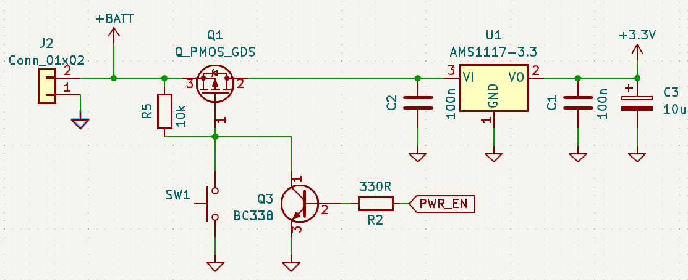

# rfid-lock
Low power RFID lock using MFRC522 and MSP430.

## Project assumptions
 * battery powered
 * no power consumption when not used

## Theory of operation

To assure zero idle current I use a MOSFET that gates the power supply to the lock.

Pushing a button turns on the MOSFET for a short time, but long enough for MCU to hold the gate to GND and perform the following operations:
 * check RFID tag present
 * actuate servo

### Lock opening
 * stick RFID tag to antenna and push the button

### Lock closing
 * just push the button

I understand it might be not the best solution in case fully hidden lock is desired (without push button), but in such case the _button_ can be replaced with a hidden reed switch.